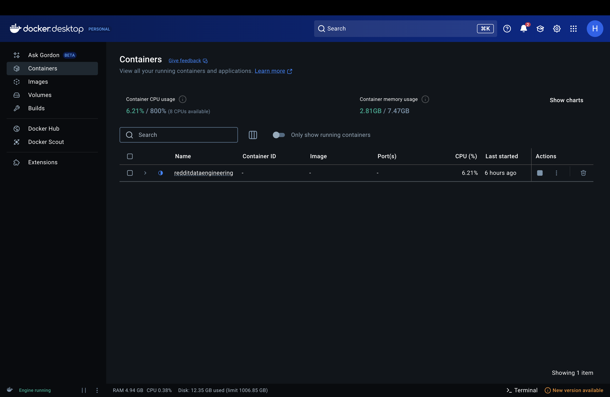
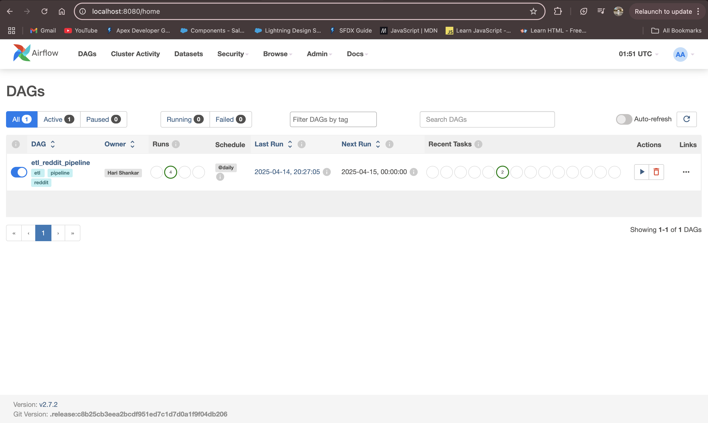
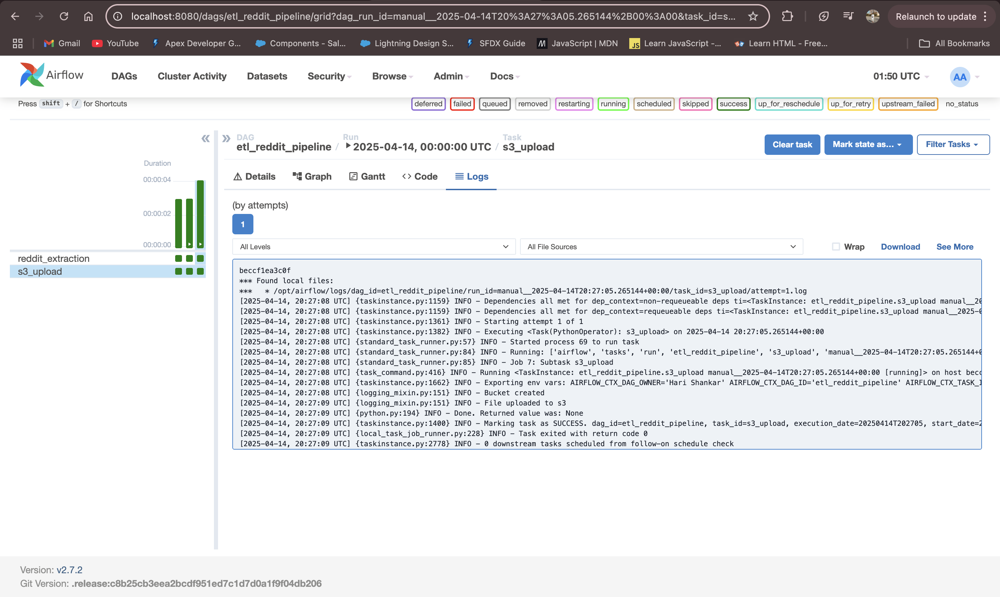
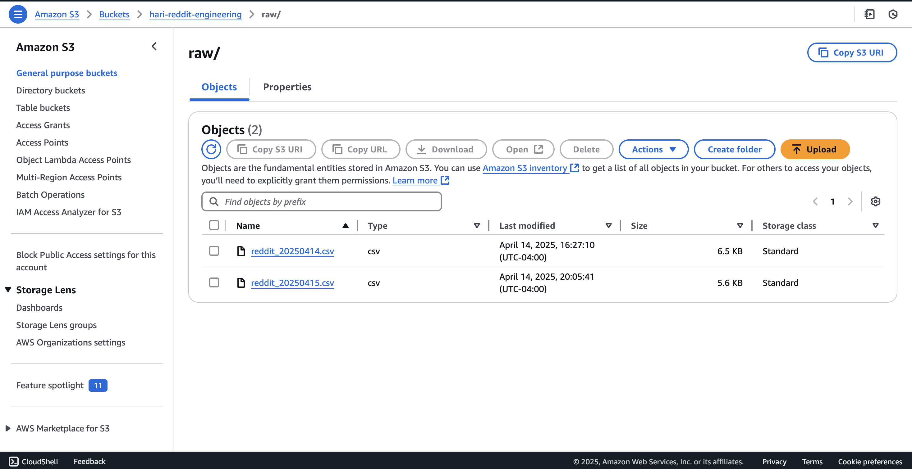
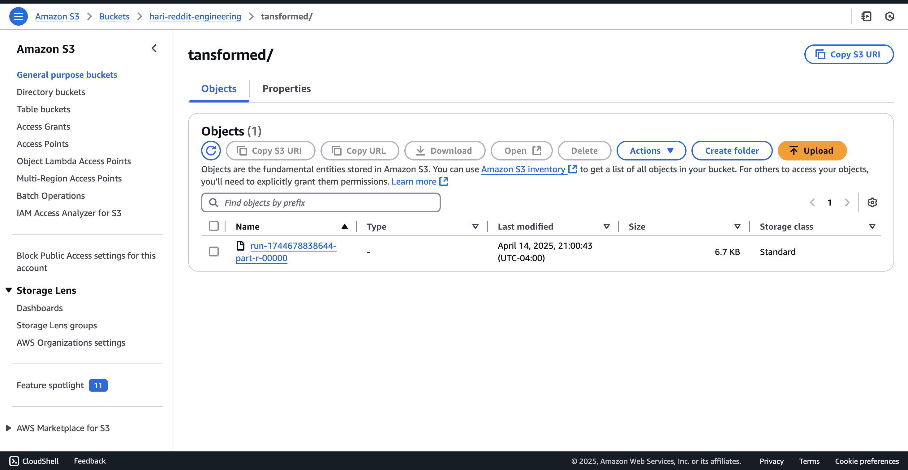
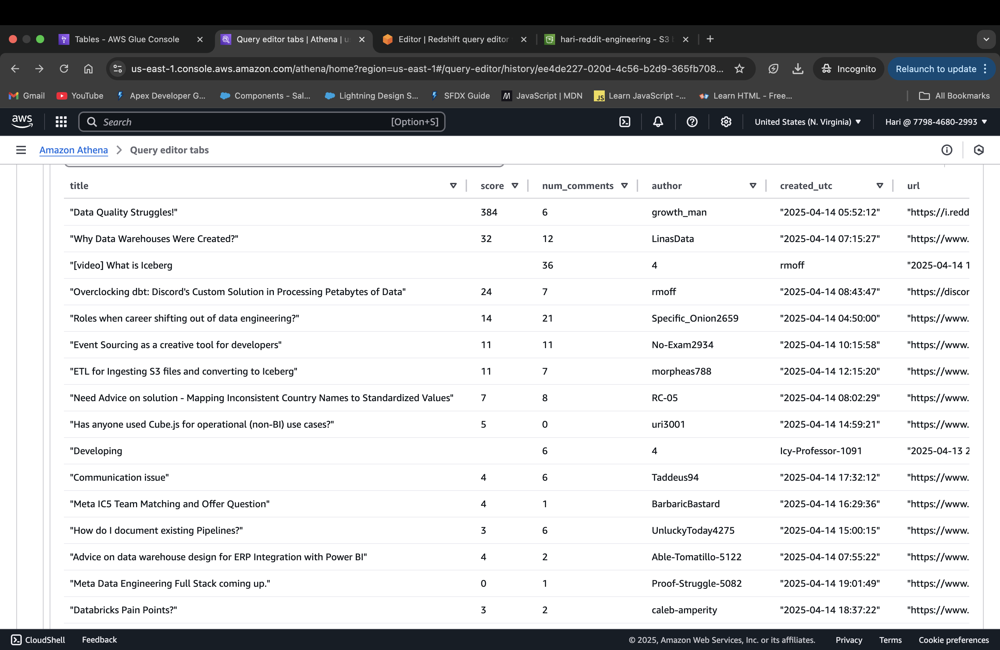
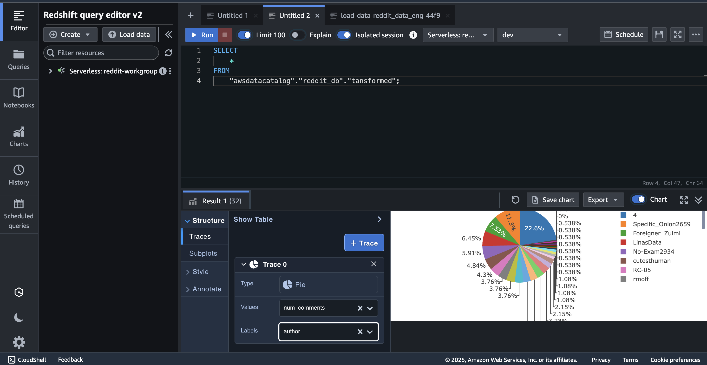

# Reddit Data Engineering Pipeline (Airflow + AWS)

This project is an end-to-end data pipeline that extracts top posts from Reddit, processes and stores them in Amazon S3, transforms them with AWS Glue, and makes the data queryable using Athena and Redshift. The orchestration is handled using Apache Airflow and Docker.

---

## 🚀 What This Project Does

- Extracts Reddit data using Reddit API and PRAW (Python Reddit API Wrapper)
- Orchestrates ETL jobs using Apache Airflow + Celery
- Stores data in Amazon S3 (raw & transformed folders)
- Cleans/transforms data using AWS Glue
- Queries data via Amazon Athena
- Loads into Amazon Redshift for advanced analytics and charting

---

## Tools & Technologies Used

| Tool            | Purpose                        |
|-----------------|--------------------------------|
| Airflow + Celery| DAG orchestration and task queues |
| PostgreSQL      | Airflow metadata DB            |
| Docker          | Local containerized setup      |
| Reddit API + PRAW | Data extraction               |
| S3              | Cloud data lake                |
| AWS Glue        | ETL & cataloging               |
| Athena          | Serverless SQL queries         |
| Redshift        | Data warehousing and BI        |

---

## Architecture


---

## 🧩 Project Structure

```
RedditDataEngineering/
│
├── dags/                    → Airflow DAG definitions
│   └── reddit_dag.py
│
├── pipelines/              → Custom logic for Reddit ETL
│   └── reddit_pipeline.py
│
├── etls/
│   ├── reddit_etl.py       → Reddit API extract logic
│   └── aws_etl.py          → AWS S3 handling
│
├── config/
│   └── config.conf         → Reddit & AWS credentials
│
├── utils/
│   └── constants.py        → Paths and keys
│
├── docker-compose.yml      → All services setup
└── requirements.txt
```

---

## ⚙️ Getting Started

1. **Clone the repository**
   ```bash
   git clone https://github.com/Harishankarreddy01/reddit-data-engineering.git
   cd reddit-data-engineering
   ```

2. **Configure credentials**
   ```bash
   cp config/config.conf.example config/config.conf
   # Then edit the file with your Reddit and AWS keys
   ```

3. **Start Docker containers**
   ```bash
   docker-compose up --build
   ```

📸 *Running container in Docker Desktop*



---

## 🌀 Airflow DAG Setup

The DAG `etl_reddit_pipeline` runs the following steps:

- `reddit_extraction`: Extracts and processes top posts from Reddit
- `s3_upload`: Uploads the CSV to S3

📸 *Airflow DAG view*



📸 *Logs of successful DAG run*



---

## Data Landing in S3

After a successful run, your S3 bucket will contain:

- `raw/`: Raw extracted CSVs
- `transformed/`: Output from AWS Glue
- `athena_scripts/`: Athena SQL queries (optional)

📸 *S3 bucket structure*



---

## Data Transformation with AWS Glue

We configured a Glue job to clean and reformat data using PySpark.

- Reads data from `raw/`
- Applies transformations
- Saves the output to `transformed/`



---

## Querying in Athena

Use AWS Athena to query the transformed data directly from S3 using SQL.

📸 *Athena table preview*



---

## Loading into Redshift + Visualization

The final transformed data is made available in **Redshift** via Glue Data Catalog. You can use SQL to query and visualize data (e.g., top authors by comment count).

📸 *Redshift charting*



---

## ✅ Outcome

This project mimics a real-world, production-grade batch data pipeline using industry-standard tools. It demonstrates:

- API-based ingestion
- Event-based orchestration
- Scalable storage and compute
- Cloud-based querying and warehousing

---

## Author

**Hari Shankar Reddy Mandapati**  
Data Scientist | MS CS @ UNCC  
GitHub: [Harishankarreddy01](https://github.com/Harishankarreddy01)  
LinkedIn: https://www.linkedin.com/in/sri-hari-shankar-reddy-mandapati02/

